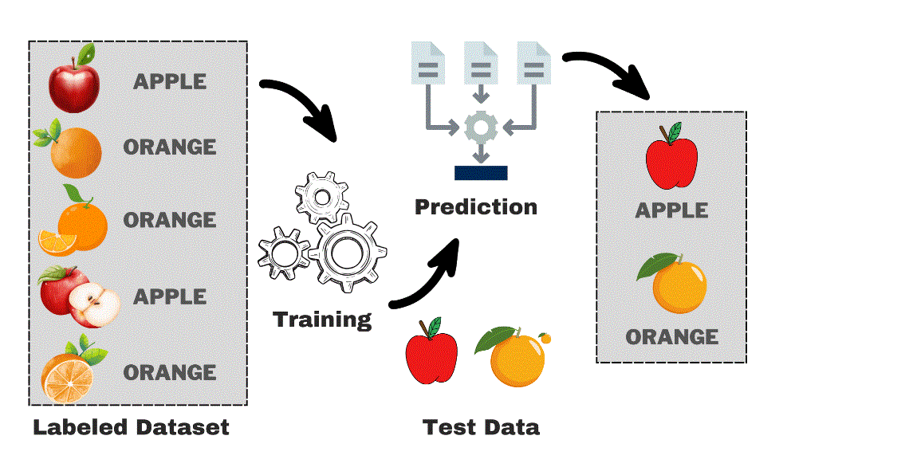

SUERVISED MACHINE LEARNING

Supervised machine learning involves training a model on labeled data to learn a mapping from inputs to outputs. By iteratively adjusting its parameters based on the training data, the model aims to make accurate predictions on new, unseen data.

## Visualization of Supervised Machine Learning

UNDERSTANDING SUPERVISED MACHINE LEARNING

Supervised Learning involves training an algorithm on a labeled dataset, which allows it to make predictions on new, unlabeled data. The two main types of supervised learning are classification and regression.

In classification, the algorithm predicts categorical labels and assigns data inputs to specific categories. On the other hand, regression involves predicting a continuous quantity, making it suitable for estimating numerical values from input data. Both approaches are fundamental to supervised machine learning and are extensively applied in various real-life scenarios.

CORE PRINCIPLES

Classification: Assigns categorical labels to data inputs.

Regression: Estimates a continuous numerical output.

Training Data: Collection of data used for training the algorithm.

Test Data: Data used to test the algorithm's predictive performance.

IMPLEMENTING SUPERVISED MACHINE LEARNING

Data Collection: Assemble and label a dataset.

Preprocessing: Clean and organize the data into a usable format.

Model Selection: Select a model that fits the problem at hand.

Training: Use the training data to educate the model.

Evaluation: Assess the model using the test data to verify its accuracy.

METRICS FOR EVALUATING SUPERVISED MACHINE LEARNING

Accuracy: Measures the correctness of classification predictions.

Mean Squared Error (MSE): Evaluates the average of the squares of the errors in regression.

Confusion Matrix: Outlines the performance of a classification model.

Precision, Recall, and F1 Score: Crucial for evaluating binary classification tasks.

STARTING WITH MACHINE LEARNING

Prerequisites: Basic knowledge in Python, statistics, and data analytics.

Libraries: Get acquainted with tools like Scikit-learn, TensorFlow, or PyTorch.

Experimentation: Test various algorithms on different datasets to discover the most effective strategies.
